# H1_2 混合控制测试

**语言版本**: [🇨🇳 中文 (当前)](#) | [🇺🇸 English](README.md)

H1_2人形机器人混合控制测试集，结合下半身由强化学习策略控制，上半年由轨迹控制。

## 📋 目录

- [概述](#概述)
- [系统架构](#系统架构)
- [演示视频](#演示视频)
- [快速开始](#快速开始)
- [开发指南](#开发指南)

## 概述

H1_2 混合控制系统为人形机器人实现了双重控制架构，将27个自由度分配到专门的控制域：

- **下半身（12 DOF）**：基于PPO的运动控制，实现稳定的双足步态和平衡
- **上半身（15 DOF）**：基于轨迹的控制，支持复杂的操作和表达性动作

## 系统架构

### 基于PPO的下半身控制（12 DOF）
- **关节**：每条腿6个自由度（3个髋关节 + 1个膝关节 + 2个踝关节）
- **观测**：47维状态向量（基础方向、关节状态、动作历史、步态相位）
- **动作**：12维连续关节角度偏移
- **训练**：在Isaac Gym上使用PPO算法和多目标奖励
- **更新频率**：50Hz

### 基于轨迹的上半身控制（15 DOF）
- **关节**：1个躯干 + 每个手臂7个（肩部、肘部、腕部关节）
- **控制**：PD控制器配合预定义运动基元
- **更新频率**：50Hz（与强化学习策略同步）

### MuJoCo环境关节顺序

系统采用以下27个关节的标准顺序进行控制：

```python
MUJOCO_JOINT_ORDER = [
    # 下半身关节 (12 DOF) - 强化学习控制
    'left_hip_yaw_joint',    'left_hip_pitch_joint',   'left_hip_roll_joint',
    'left_knee_joint',       'left_ankle_pitch_joint', 'left_ankle_roll_joint',
    'right_hip_yaw_joint',   'right_hip_pitch_joint',  'right_hip_roll_joint', 
    'right_knee_joint',      'right_ankle_pitch_joint','right_ankle_roll_joint',
    
    # 上半身关节 (15 DOF) - 轨迹控制
    'torso_joint',                                     # 躯干 (1 DOF)
    'left_shoulder_pitch_joint', 'left_shoulder_roll_joint', 'left_shoulder_yaw_joint',  # 左肩 (3 DOF)
    'left_elbow_pitch_joint',    'left_elbow_roll_joint',                                # 左肘 (2 DOF)
    'left_wrist_pitch_joint',    'left_wrist_yaw_joint',                                 # 左腕 (2 DOF)
    'right_shoulder_pitch_joint','right_shoulder_roll_joint','right_shoulder_yaw_joint', # 右肩 (3 DOF)
    'right_elbow_pitch_joint',   'right_elbow_roll_joint',                               # 右肘 (2 DOF)
    'right_wrist_pitch_joint',   'right_wrist_yaw_joint'                                 # 右腕 (2 DOF)
]
```
### 支持的轨迹

#### 静态姿态
- `pose_arms_forward` - 双臂前伸
- `pose_t_shape` - T字型张开姿态
- `pose_arms_up` - 胜利手势，双臂上举
- `pose_left_down_right_forward` - 不对称指向手势
- `pose_left_down_right_side` - 不对称侧向姿态
- `pose_torso_side_twist` - 躯干旋转演示

#### 动态运动
- `2arms_circles` - 同步双臂摆动
- `2arms_waving` - 双臂挥手问候
- `1arm_circles` - 单臂摆动
- `1arm_waving` - 单臂挥手

#### 复合动作
- `taichi` - 太极推手动作
- `boxing` - 拳击动作
- `random` - 随机上肢运动


## 演示视频

所有视频演示展示不同的运动命令：`[前进，侧向，角度]`
其中，`静止站立`的命令为`[0.0, 0.0, 0.0]`，`前进行走`的命令为`[0.5, 0.0, 0.0]`， `转向行走`的命令为`[0.5, 0.3, 0.0]`。


> **💡 提示**: 视频文件位于 `demo/` 目录。
### 静态姿态演示

#### 双臂前伸姿态 (pose_arms_forward)
<table>
<tr>
<td width="33%" align="center">
<strong>静止站立</strong><br>
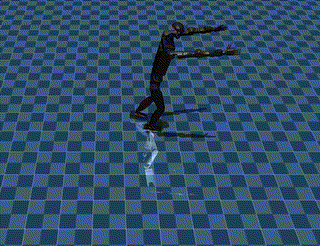
</td>
<td width="33%" align="center">
<strong>前进行走</strong><br>
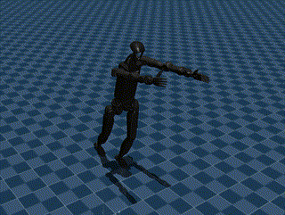
</td>
<td width="33%" align="center">
<strong>转向行走</strong><br>
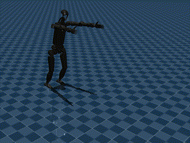
</td>
</tr>
</table>

#### T字形张开姿态 (pose_t_shape)
<table>
<tr>
<td width="33%" align="center">
<strong>静止站立</strong><br>
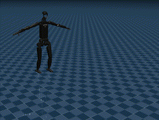
</td>
<td width="33%" align="center">
<strong>前进行走</strong><br>
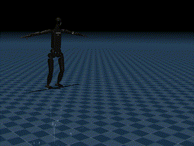
</td>
<td width="33%" align="center">
<strong>转向行走</strong><br>
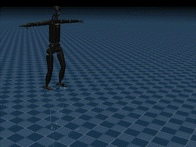
</td>
</tr>
</table>

#### 双臂上举姿态 (pose_arms_up)
<table>
<tr>
<td width="33%" align="center">
<strong>静止站立</strong><br>
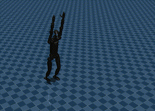
</td>
<td width="33%" align="center">
<strong>前进行走</strong><br>
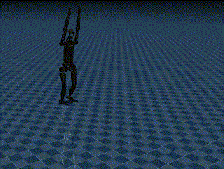
</td>
<td width="33%" align="center">
<strong>转向行走</strong><br>
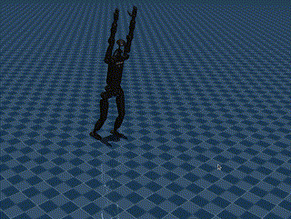
</td>
</tr>
</table>

#### 左下右前姿态 (pose_left_down_right_forward)
<table>
<tr>
<td width="33%" align="center">
<strong>静止站立</strong><br>
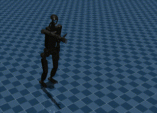
</td>
<td width="33%" align="center">
<strong>转向行走</strong><br>
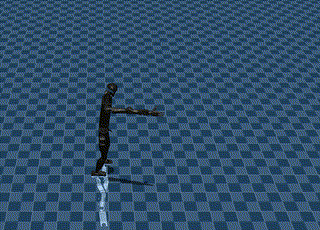
</td>
<td width="33%" align="center">
<strong>转向行走</strong><br>
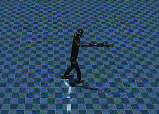
</td>
</tr>
</table>

#### 左下右侧姿态 (pose_left_down_right_side)
<table>
<tr>
<td width="33%" align="center">
<strong>静止站立</strong><br>
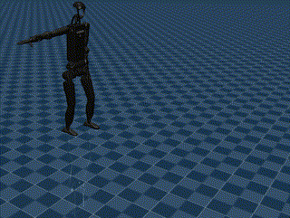
</td>
<td width="33%" align="center">
<strong>前进行走</strong><br>
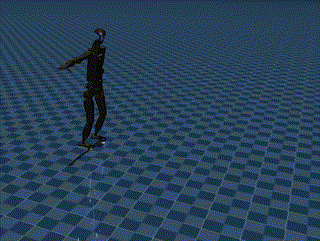
</td>
<td width="33%" align="center">
<strong>转向行走</strong><br>
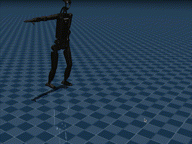
</td>
</tr>
</table>

#### 躯干侧扭姿态 (pose_torso_side_twist)
<table>
<tr>
<td width="33%" align="center">
<strong>静止站立</strong><br>
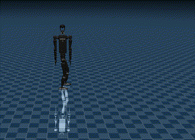
</td>
<td width="33%" align="center">
<strong>前进行走</strong><br>
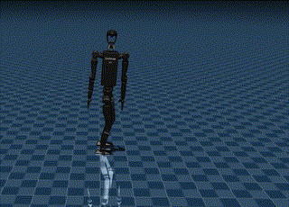
</td>
<td width="33%" align="center">
<strong>转向行走</strong><br>
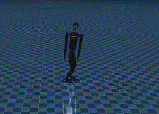
</td>
</tr>
</table>

### 动态轨迹演示

#### 双臂圆周摆动 (2arms_circles)
<table>
<tr>
<td width="33%" align="center">
<strong>静止站立</strong><br>
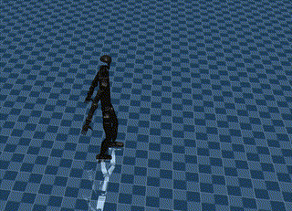
</td>
<td width="33%" align="center">
<strong>前进行走</strong><br>
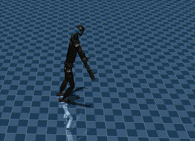
</td>
<td width="33%" align="center">
<strong>转向行走</strong><br>
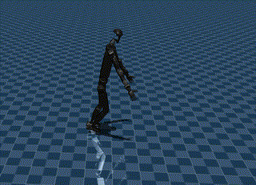
</td>
</tr>
</table>

#### 双臂挥手动作 (2arms_waving)
<table>
<tr>
<td width="33%" align="center">
<strong>静止站立</strong><br>
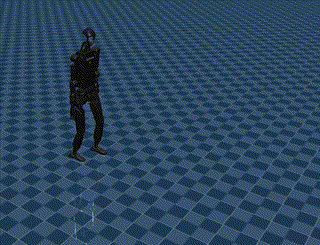
</td>
<td width="33%" align="center">
<strong>前进行走</strong><br>
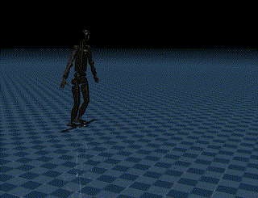
</td>
<td width="33%" align="center">
<strong>转向行走</strong><br>
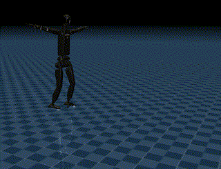
</td>
</tr>
</table>

#### 单臂圆周摆动 (1arm_circles)
<table>
<tr>
<td width="33%" align="center">
<strong>静止站立</strong><br>
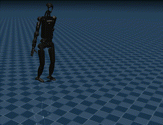
</td>
<td width="33%" align="center">
<strong>前进行走</strong><br>
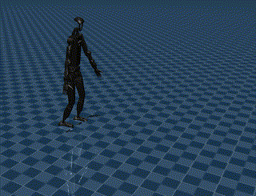
</td>
<td width="33%" align="center">
<strong>转向行走</strong><br>
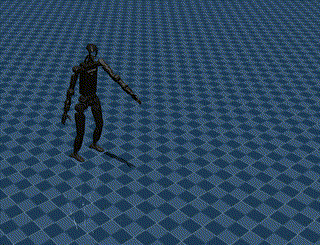
</td>
</tr>
</table>

#### 单臂挥手动作 (1arm_waving)
<table>
<tr>
<td width="33%" align="center">
<strong>静止站立</strong><br>
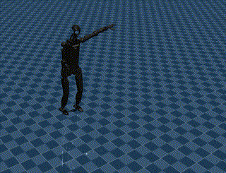
</td>
<td width="33%" align="center">
<strong>前进行走</strong><br>
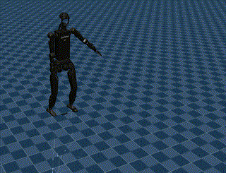
</td>
<td width="33%" align="center">
<strong>转向行走</strong><br>
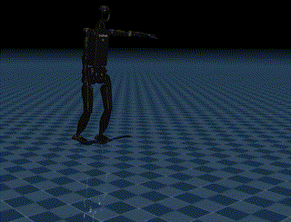
</td>
</tr>
</table>

### 复杂运动演示

#### 太极推手动作 (taichi)
<table>
<tr>
<td width="33%" align="center">
<strong>静止站立</strong><br>
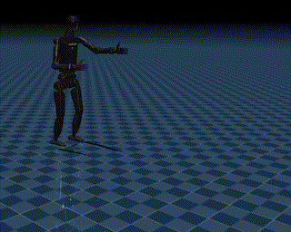
</td>
<td width="33%" align="center">
<strong>前进行走</strong><br>
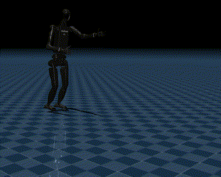
</td>
<td width="33%" align="center">
<strong>转向行走</strong><br>
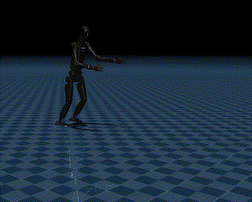
</td>
</tr>
</table>

#### 拳击动作 (boxing)
<table>
<tr>
<td width="33%" align="center">
<strong>静止站立</strong><br>
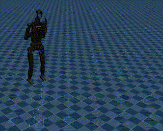
</td>
<td width="33%" align="center">
<strong>前进行走</strong><br>
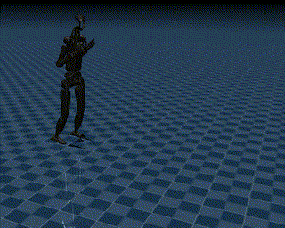
</td>
<td width="33%" align="center">
<strong>转向行走</strong><br>
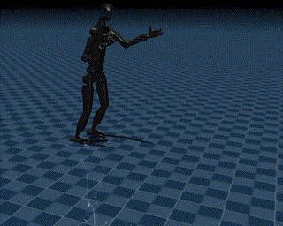
</td>
</tr>
</table>

#### 随机运动 (random)
<table>
<tr>
<td width="33%" align="center">
<strong>静止站立</strong><br>
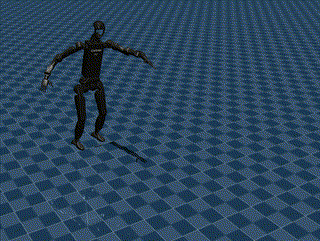
</td>
<td width="33%" align="center">
<strong>前进行走</strong><br>
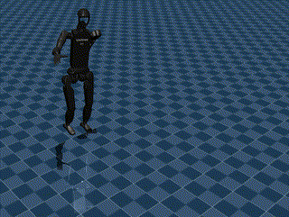
</td>
<td width="33%" align="center">
<strong>转向行走</strong><br>
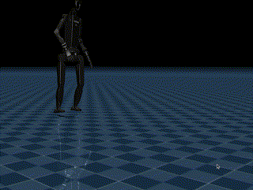
</td>
</tr>
</table>

## 快速开始

### 基本用法
```bash
python deploy_mujoco_hybrid.py <配置> -t <类型> --cmd <运动命令>
```

**示例**:
```bash
# 静态姿态
python deploy_mujoco_hybrid.py h1_2_hybrid.yaml -t pose_t_shape
python deploy_mujoco_hybrid.py h1_2_hybrid.yaml -t pose_arms_up --cmd 0.5,0,0.3

# 动态轨迹  
python deploy_mujoco_hybrid.py h1_2_hybrid.yaml -t 2arms_circles --cmd 1.0,0,0
python deploy_mujoco_hybrid.py h1_2_boxing.yaml -t boxing --cmd 0.6,0.3,0.5
#为了更好地展示拳击动作，建议使用`h1_2_boxing.yaml`配置文件。
./demo_all_trajectories.sh              # 所有轨迹的演示脚本
```


## 配置说明

### 主配置文件: `h1_2_hybrid.yaml`
```yaml
# 路径
policy_path: "{LEGGED_GYM_ROOT_DIR}/logs/h1_2/exported/policies/policy_lstm_1.pt"
xml_path: "{LEGGED_GYM_ROOT_DIR}/resources/robots/h1_2/scene.xml"

# 仿真  
simulation_duration: 60.0
simulation_dt: 0.002
control_decimation: 10

# 控制参数
lower_body_kps: [200, 200, 200, 300, 40, 40] * 2  # 左腿 + 右腿
upper_body_kps: [50]+ [80, 80, 50, 50, 20, 20, 20]*2
```

## 开发指南

### 添加自定义轨迹

1. **定义轨迹函数**:
```python
def trajectory_custom(time_sim, config):
    targets = np.zeros(15)  # [躯干, 左臂×7, 右臂×7]
    # 在此处实现运动逻辑
    return targets
```
2. **在轨迹函数字典中注册**:
```python
trajectory_functions["custom"] = trajectory_custom
```
3. **添加到参数解析器选择中**。


